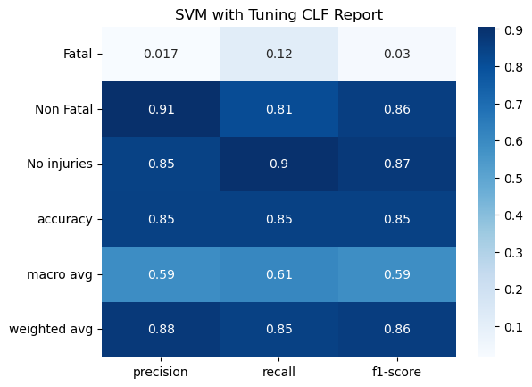
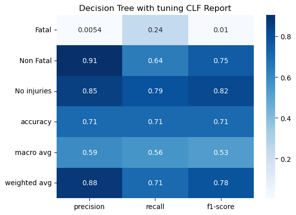
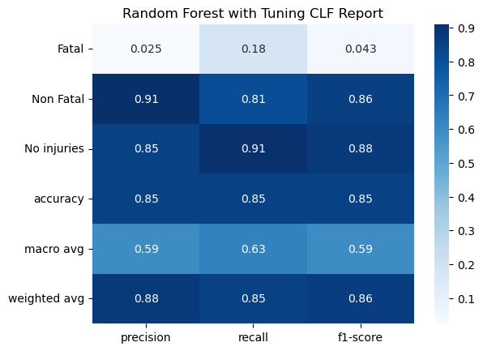

# Road Accident Severity Prediction

This project focuses on predicting the severity level of road accidents using a dataset from Kaggle. The dataset contains information on road accidents in 2020, and the target variable is the severity level, which is categorized into three classes: No Injuries, Fatal, and Non-Fatal.

The dataset used for this project is sourced from Kaggle : https://www.kaggle.com/datasets/raphaelmarconato/detran-accidents-2020

4 different machine learning models were trained in this project:
1. SVM
2. Decision Tree
3. Random Forest
4. Logistic Regression

## Results

